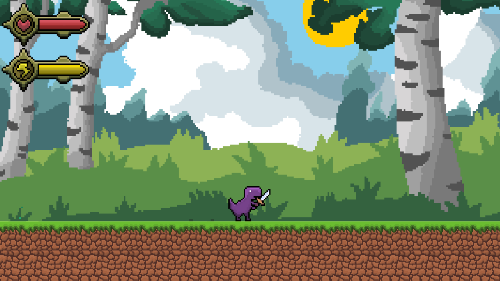

# Rex Valley 

## Introduction



**Rex Valley** is a Single-Player, small **action-adventure** game featuring the **Google Dino** as its lead protagonist! Explore this 2D world, featuring beautiful **pixel-art**, unique **bosses** and a simple yet effective, combat system. 

This **art** and the **game** itself have been made with passion by three amateur programmers for [ThirdSpace](https://thirdspace.hackclub.com/home) a [Hack Club](https://hackclub.com) YSWS.

## Running the project

The project is OS Independent and can run seamlessly on any system.

1. Install [Godot 4.7.2+](https://godotengine.org/)

2. Clone this repository:
```
    git clone https://github.com/LeeTuah/rexvalley.git
```

3. Inside Godot click **Import** and select the **project.godot** file inside the cloned folder.

4. Run the project and have fun!
